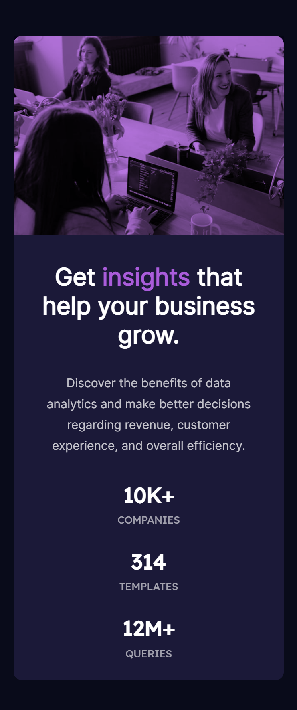

# Frontend Mentor - Stats preview card component solution

This is a solution to the [Stats preview card component challenge on Frontend Mentor](https://www.frontendmentor.io/challenges/stats-preview-card-component-8JqbgoU62). Frontend Mentor challenges help you improve your coding skills by building realistic projects. 

## Table of contents

- [Overview](#overview)
  - [The challenge](#the-challenge)
  - [Screenshot](#screenshot)
  - [Links](#links)
- [My process](#my-process)
  - [Built with](#built-with)
  - [What I learned](#what-i-learned)
  - [Useful resources](#useful-resources)
- [Author](#author)

## Overview

### The challenge

Users should be able to:

- View the optimal layout depending on their device's screen size

### Screenshot

### Links

- Solution URL: [solution url](https://www.frontendmentor.io/solutions/stats-preview-card-component-using-html-and-css-WrXekcKju)
- Live Site URL: [live site url](https://stats-preview-card-darshan.netlify.app/)

## My process

### Built with

- HTML5 markup
- CSS custom properties
- Flexbox
- Mobile-first layout

### What I learned

I learned how to add an overlay to an image. There are few different ways to do it. I did it using position absolute and relative.  

### Useful resources

- [CSS Positioning: Position absolute and relative explained](https://youtu.be/P6UgYq3J3Qs) - This is a great video by Kevin Powell which helped me understand position absolute and relative.

## Author

- Frontend Mentor - [@darshandamre](https://www.frontendmentor.io/profile/darshandamre)
- Twitter - [@darshandamre](https://www.twitter.com/darshandamre)